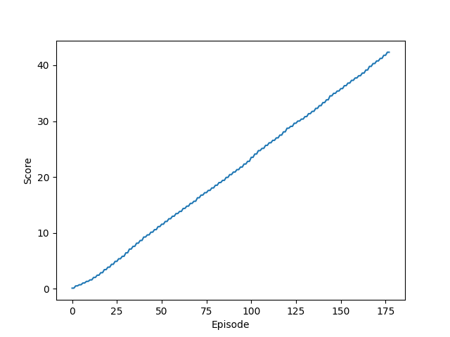

# Introduction:
This report is for the second project of Deep reinforcement learning nano-degree on Udacity.
This project is about training 20 agents to maintain its position, as many time steps as possible,
with a target location.
In this  report we will present :

1. Algorithm : the algorithm used to train the 20 agents (DDPG)
2. Hyper parameters 
3. the results 
4. Future improvements

# I- Algorithm 

In this project we use DDPG algorithm which stands for **D**eep **D**eterministic **P**olicy **G**radient

Our agents will see one state of length 33 that represents the position, velocity, rotation, velocity and angular velocities.

The agent will receive +0.1 at each time step where its hand is in contact with the target location. it outputs a vector of 4 entries as an action where each entry is between +1 and -1.

The agent is basically composed of two main neural networks (4 total):
 
 1. Actor neural network (Local and target) : the Policy Network
    - Input layer 33 nodes (the size of the state)
    - Hidden layer 256 nodes
    - output layer : size of an action

 2. Critic neural network (Local and target) : the value Network
    
    - Input layer 33 nodes (the size of the state)
    - 3 Hidden layer 256, 256, 128 nodes
    - output layer : size of an action

# II- Hyper parameters 

    BUFFER_SIZE = 1.000.000  replay buffer size
    BATCH_SIZE = 128  minibatch size
    GAMMA = 0.99  discount factor
    TAU = 0.001  for soft update of target parameters
    LR_ACTOR = 0.0001  learning rate of the actor
    LR_CRITIC = 0.0003  learning rate of the critic
    WEIGHT_DECAY = 0.0001  L2 weight decay

# III- Results :
My agent solved the environment in 178 episodes 

    Episode 1       Average Score: 0.11
    Episode 2       Average Score: 0.11
    Episode 3       Average Score: 0.25
    Episode 4       Average Score: 0.31
    Episode 5       Average Score: 0.40
                .
                .
                .
    
    Episode 173     Average Score: 28.93
    Episode 174     Average Score: 29.17
    Episode 175     Average Score: 29.42
    Episode 176     Average Score: 29.66
    Episode 177     Average Score: 29.91
    Episode 178     Average Score: 30.16
    Enviroment solved in episode=178 avg_score=30.16

Below you will find the plot of the score in each episode 

 

# IV- Future improvements :

Hyper parameter tuning can be beneficial to the learning of the agents (manipulating the learning rate, the weight decay ...)

Another technique that we can try is D4PG which stands for **D**istributed **D**istributional **D**eterministic **P**olicy **G**radients.